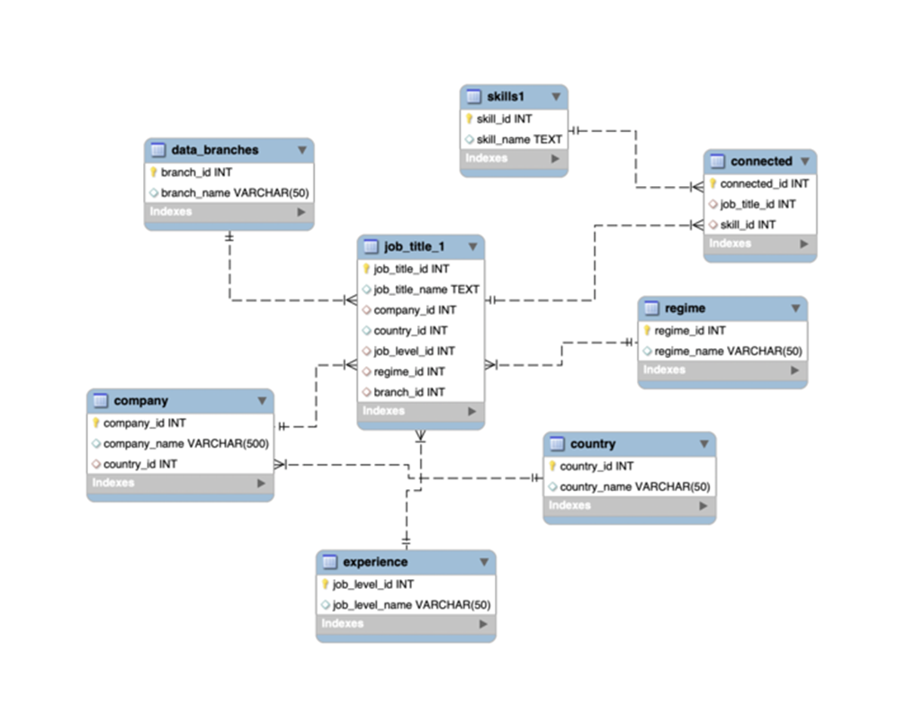

# Data Careers

The main goal of this project was to enhance **SQL** techniques.

## Overview
This was a project under the Ironhack's bootcamp scope. It was a team project on the 4th week of the bootcamp.
  
The subject of analysis was up to the team to decide, and since there were some questions regarding the different roles within the data field, this project was used to improve not only our SQL skills, but also to understand more about the field.

## Dataset
The dataset, "postings.csv", was obtained from Kaggle.  It corresponds to a dataset containing job postings from LinkedIn related to the data field.

## Objective
Having 3 major data roles (Data Analyst, Data Engineer and Data Scientist), our objective was to understand which skills they use the most, thus helping to understand their roles.

## Steps
- Data Wrangling
- Create the dataframes for each SQL table
- Create the connector dataframe between "job title" and "skills"
- Exporting dataframes as csv files
- Creating the tables on SQL with the relevant connections, resulting in the ERD below 
- Querying on SQL to obtain insights
- Export the relevant insights tables
- Data visualization on those tables

  
### ERD

